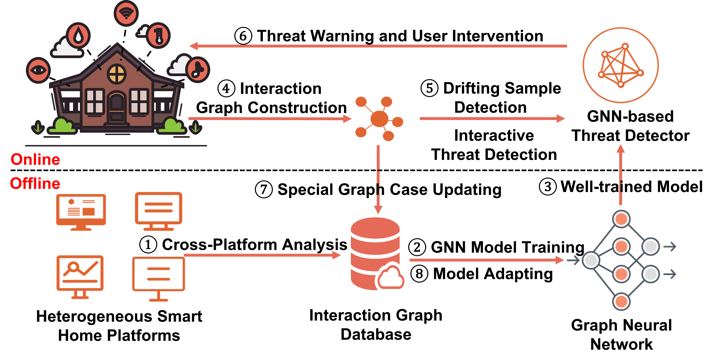

# Graph Learning for Interactive Threat Detection in Heterogeneous Smart Home Rule Data

This repo covers a reference implementation for the following papers in PyTorch:

* [Graph Learning for Interactive Threat Detection in Heterogeneous Smart Home Rule Data](https://dl.acm.org/doi/10.1145/3588956)

## Glint Architecture 

Glint is a graph learning-based system for interactive threat detection in heterogeneous smart home rule data. Glint comprises two components:

* Interaction Graph Construction: extracts home automation rules from five platforms and constructs interaction graphs.

* Graph Learning-based Model: designs ITGNN Graph representation learning model and corresponding deep learning techniques to enhance model performance.




## Interaction Graph Dataset

* We use Scrapy to crawl publicly available rule descriptions from 5 smart home platforms: SmartThings, IFTTT, Amazon Alexa, Google Assistant, and Home Automation. Here are the statistics shared in the repository.

| IFTTT   | SmartThings | Alexa Skill | Google Assistant | Home Assistant |
|---------|-------------|-------------|------------------|----------------|
|2,339 | 185         | 6,548       | 4,812            | 575            |

Note: the synthesized dataset in this repository is slightly different from those reported in the paper due to the unpublished third-party dataset and the continued updates over a two-year frame of the project.

* We construct interaction graphs on single platforms or cross-platforms and compose homogeneous graph datasets and heterogeneous graph datasets. We use the Deep Graph Library (DGL) to build the graph datasets. The stored labeled graph dataset file for IFTTT is 21.8 GB, the one for SmartThings is about 18 MB, and the heterogeneous graph amounts to 81.6 GB.


## ITGNN Graph Model

We design the unified ITGNN model for multi-scale graph representation learning.

To train the model:

1. Clone the repository.
1. Configure the Anaconda environment according to the [package_list.txt](./package-list.txt) file.
1. Run `./ITGNN/main.py` or use the script [ITGNN.sh](ITGNN/ITGNN.sh)

The arguments are described in greater detail in the source files.

## Citation
```
@article{wang2023graph,
  title={Graph Learning for Interactive Threat Detection in Heterogeneous Smart Home Rule Data},
  author={Wang, Guangjing and Ivanov Nikolay and Chen, Bocheng and Wang, Qi and Nguyen, Thanhvu and Yan, Qiben},
  journal={Proceedings of the ACM on Management of Data (PACMMOD)},
  volume={1},
  number={1},
  year={2023},
  publisher={ACM}
}
```